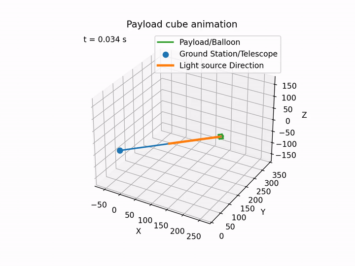

# HAB_ADCS_SIM

Physics simulation of a high-altitude balloon payload's attitude dynamics. The project includes simulated reaction wheel control, momentum dumping with a non-interfering low-torque motor, and modeled sensors, actuators, and wind disturbances gathered from flight data.

Check out the Wiki for more background and additional project details.

## Simulation demo

