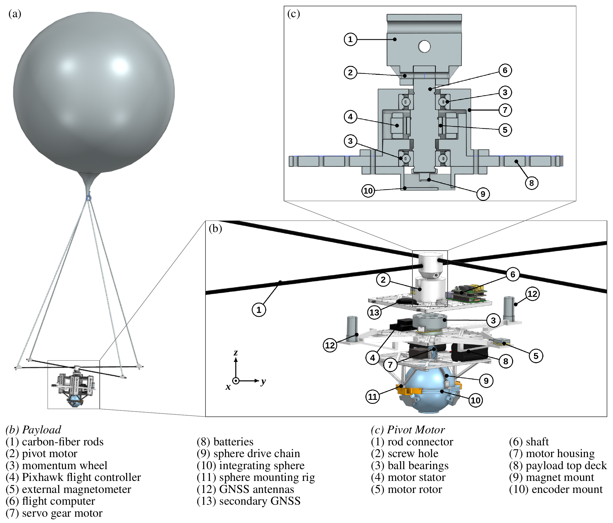
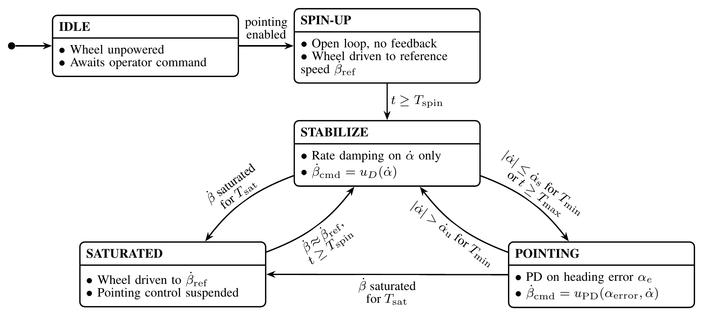
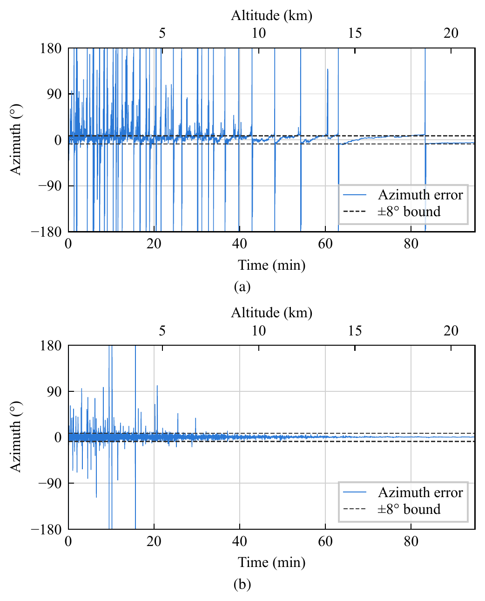
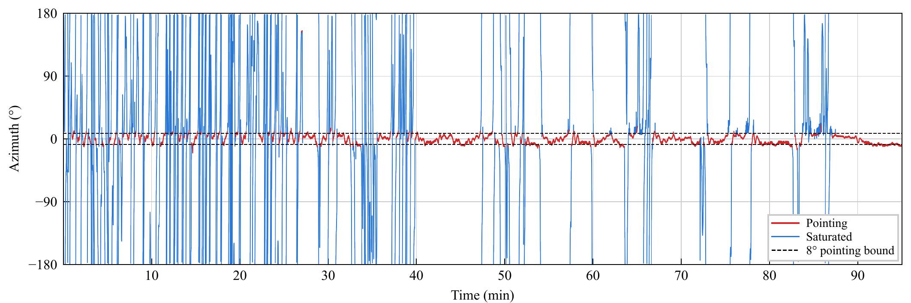

<h1 align="center">HAB ADCS Simulation</h1>

<p align="center"><i>Keeping a balloon payload pointed at a telescope from 20 km up.</i></p>

<p align="center">
  
  
  
  
  
</p>

<p align="center">
  
</p>

<p align="center"><sub>A gust pushes the momentum wheel to its speed limit. The flight computer spins it back down, steadies the payload and finds the ground station again.</sub></p>

## Overview

ALTAIR (Airborne Laser for Telescopic Atmospheric Interference Reduction) flies a calibrated light source on a high-altitude balloon, as an artificial star that ground-based telescopes can calibrate against. The exit port of the light source is approximately Lambertian, precisely pointing the exit port into the telescope's aperture is essential to ensuring reducing the uncertainty in the flux measurements due to variation in the relative angle during flight. The payload has to offset wind disturbances to keep the sphere pointed and a momentum management system is built with a custom pivot motor joint to ensure pointing is not interrupted due to motor saturation.

This repo is the physics simulation I built to design that pointing system. It models the paylaod attitude dynamics, transient electromechanical motor models, sensor models, wind disturbance models trained on flight data and the state machine used in flight.

## Payload

<p align="center"></p>

| Part | Job |
|---|---|
| Integrating sphere | The calibrated artificial star-like source to image |
| Servo | Pitches the sphere |
| Momentum wheel | Torques the payload by momentum exchange |
| Pivot motor | Torques the payload against the flight-train and balloon, allowing momentum transfer |
| Carbon-fiber booms | Rigged to the balloon neck to stop the payload swinging |
| Pixhawk, magnetometer, dual GNSS | Estimate payload heading in an inertial frame despite sources of magnetic interference |

## What is modelled

- Azimuth dynamics of the payload
- Brushless motor models with back-EMF speed limits and viscous and Coulomb friction
- Noisy gyro, IMU, tachometer and GNSS measurements
- Wind disturbance trained on real flight data to generate surrogate data models
- The same pointing state machine as the flight computer
- Monte Carlo campaigns testing system robustness against varying system parameter

<details>
<summary><b>Momentum wheel saturation</b></summary>
<br>

The wheel can only spin so fast. When it hits its limit it can't turn the payload any further, so the flight computer drops the target, brings the wheel back to its reference speed, damps the spin and starts pointing again. 

<p align="center"></p>

</details>

## Results

### Pointing with the pivot motor

<p align="center"></p>

<p align="center"><sub>Azimuth error over a simulated ascent: (a) momentum wheel only, (b) momentum wheel with the pivot motor.</sub></p>

With the momentum wheel alone, the steady wind fills up the wheel every few minutes low in the ascent, and every desaturation sends the payload spinning (the spikes to ±180°). With the pivot motor bleeding that momentum off, the payload stays within ±8° for 97% of the ascent instead of 74%, and the longest pointing window grows from 15 to 45 minutes.

### Simulation vs flight

<p align="center"></p>

<p align="center"><sub>Azimuth during the ascent of Flight 2 (May 27, 2026), flown with the momentum wheel only. Red is pointing, blue is the wheel saturated and recovering.</sub></p>

The wheel-only system was flown and controlled similarly to (a) above, and logged 53 windows of 30 s within ±8°. The simulation reproduces the saturation and recovery pattern, the slow drift during long pointing windows and the way the disruptions thin out with altitude. 

## Repository layout

```
src/sim_tools/        dynamics, motors, sensors, controller, pointing state machine, wind
src/hab_adcs_sim/     single runs, Monte Carlo campaigns, figures
config/sim_params/    parameter file
config/campaigns/     Monte Carlo campaign files
config/ressources/    flight data used for the wind
tests/                pytest suite
```

## About

Made by [Yorgo Abou Haidar](https://github.com/yorgoah) for ALTAIR, a McGill University and University of Victoria project.
