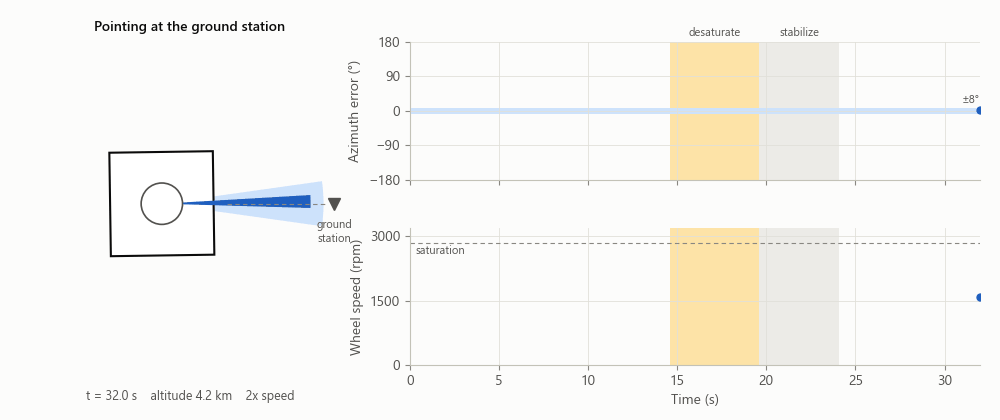
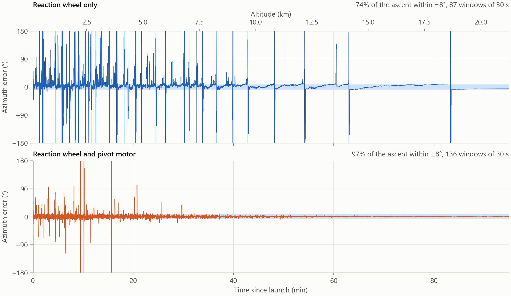
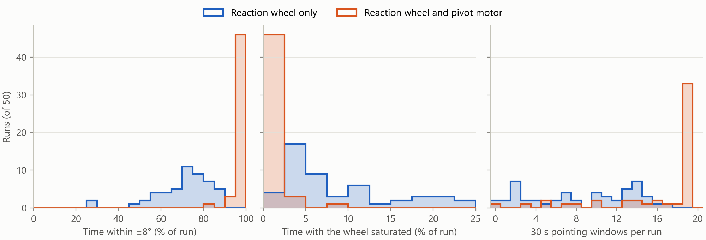

# HAB ADCS Simulation

Yaw attitude simulation of the ALTAIR high-altitude balloon payload, used to design its reaction wheel pointing and momentum management.



At 4 km the wind drives the reaction wheel to its speed limit and the payload drifts off target. The flight computer flags the wheel as saturated and ramps it back to its 1500 rpm bias, which spins the payload as it takes up the momentum. It then damps the spin and points back at the ground station.

## Background

The ALTAIR project aims to provide precise photometric calibration for ground-based telescopes by flying calibrated, and real-time optically measured, light sources on high-altitude balloons. Pointing of the light source into the telescope aperture is vital to reducing uncertainty related to attitude estimation. Since the emitted light's perceived brightness is a cosine function of its relative angle to the observer, a larger relative angle means that uncertainties in the relative angle estimate translate to large uncertainties in the measured brightness. The solution is to use a reaction wheel for fine azimuthal pointing of the payload and a momentum management system to prevent motor saturation, the design of this control system is supported by this simulation.

## What is modelled

- Payload yaw dynamics with a reaction wheel (Maxon EC60) under speed control, and an optional pivot motor between the payload and the flight train that dumps the wheel's momentum.
- The flight computer's pointing state machine (`src/sim_tools/pointing.py`): pointing, rate damping when the payload spins, and desaturation when the wheel nears its speed limits. The thresholds and gains are the flight ones.
- IMU, gyroscope, tachometer and GPS with white noise and random walk.
- Wind torque from flight data. The yaw acceleration logged on a passive flight (log137) is turned into new torque histories with IAAFT surrogates, which keep the flight's spectrum and heavy-tailed gusts but never repeat it. A steady torque and the gust level scale with air density along the ascent, fitted to the May 27 2026 flight, the only one flown with the wheel active.

## Results

### One ascent



Two simulated ascents to 21 km with the default parameters. With the wheel alone, the steady wind saturates the wheel every one to three minutes below 10 km, and each desaturation knocks the payload off target, often by a full turn. With the pivot motor dumping momentum, the payload stays within ±8° for 97% of the ascent.

### Monte Carlo



50 runs of 600 s per configuration, each at a fixed altitude between 1 and 25 km with its own wind, dispersing the payload and wheel inertia and the friction coefficients. Median time within ±8° is 74% with the wheel only and 100% with the pivot motor, and the median number of 30 s pointing windows goes from 10 to 19.

## Installation

Needs Python 3.14 and [Poetry](https://python-poetry.org/docs/#installation).

```bash
poetry install
poetry run pytest
```

## Running a simulation

```bash
poetry run python src/hab_adcs_sim/simulation_runner.py --parameters config/sim_params/parameters_ec60.json
```

The run is saved to `results/simulation_results_<timestamp>.pkl`, a dict with the `parameters` and a DataFrame `data` with one row per time step (yaw, yaw rate, wheel speed and current, wind torque, azimuth error, pointing state, altitude, ...). The default parameter file is a full 95 min ascent at a 1 ms step, which takes about 10 minutes.

Main settings in `config/sim_params/parameters_ec60.json`:

| Key | |
|---|---|
| `simulation.duration`, `simulation.time_step` | Run length and integration step (s) |
| `pointing.state_machine` | `false` keeps the wheel in the plain pointing loop |
| `lt_motor.activate` | Pivot motor momentum dumping |
| `lt_motor.coulomb_friction` | Pivot motor bearing drag, acts even when the motor is off. Set to 0 to reproduce the May 27 drift |
| `wind_params.model` | `surrogate` (default), `replay` to play log137 from `start`, or `synthetic` (AR + von Karman, not fitted to flight) |
| `wind_params.steady_torque_per_density` | Steady wind torque per unit air density, 0 turns it off |
| `wind_params.start_altitude_m`, `wind_params.ascent_rate_m_s` | Ascent profile |
| `wind_params.gust_rms_sea_level`, `gust_density_exponent`, `gust_rms_log_sigma` | Gust level, how it falls with density, and its spread between runs |

The gust density exponent (1) is a guess: the gust level in the flight logs barely changes with altitude, so it isn't fitted yet.

## Monte Carlo campaigns

```bash
poetry run python -m hab_adcs_sim.monte_carlo generate config/campaigns/nominal_wheel_only.toml
poetry run python -m hab_adcs_sim.monte_carlo run monte_carlo/nominal_wheel_only --workers 3
poetry run python -m hab_adcs_sim.monte_carlo status monte_carlo/nominal_wheel_only
```

A campaign file lists the cases to compare, the parameters to disperse and the number of runs (see `config/campaigns/example_ec60.toml`). Each run gets a directory with its parameter file, the simulation output and an `analysis.pkl` with its metrics, which are defined in `src/hab_adcs_sim/monte_carlo/per_run_analysis.py`. Running a command again picks up where it stopped. The number of workers is limited by RAM since each run keeps its whole log in memory. A 600 s run takes about a minute.

## Figures

```bash
poetry run python -m hab_adcs_sim.figures ascent results/<wheel_only>.pkl results/<with_pivot>.pkl
poetry run python -m hab_adcs_sim.figures monte-carlo monte_carlo/nominal_wheel_only monte_carlo/nominal_pivot_motor
poetry run python -m hab_adcs_sim.figures animate results/<wheel_only>.pkl --start 1074 --duration 32
```

The wheel only ascent uses the default parameter file. The pivot motor one sets `lt_motor.activate` to `true` and `pointing.state_machine` to `false`.

## Repository layout

```
src/sim_tools/        dynamics, motors, sensors, controller, pointing state machine, wind
src/hab_adcs_sim/     single runs, Monte Carlo campaigns, figures
config/sim_params/    parameter file
config/campaigns/     Monte Carlo campaign files
config/ressources/    log137 yaw acceleration used for the wind
tests/                pytest suite
```
